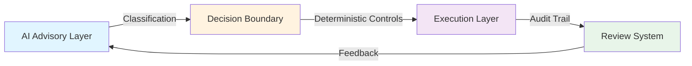

<div align="center">

# PRASHANT KUMAR

### Workflow Governance Architect | AI Accountability Systems | Risk-Safe Automation

[](https://linkedin.com/in/prashantbiz)
[](mailto:prashantbizofficial@gmail.com)
[](https://www.linkedin.com/in/prashantbiz)


---

**I design AI systems that survive board review.**  
**When Finance, IT, and Risk ask "Can you explain this decision?" — the answer is yes.**

</div>

---

## 🎯 Core Expertise

```plaintext
┌─ WORKFLOW GOVERNANCE ────────────────────────────────────────┐
│                                                              │
│  • Deterministic Decision Paths      • Audit-Ready Design   │
│  • AI Accountability Architecture    • Regulatory Mapping   │
│  • Risk Control Boundaries           • Failure Mode Design  │
│                                                              │
└──────────────────────────────────────────────────────────────┘
```

**Specialization:**  
Making opaque AI systems inspectable, traceable, and defensible for high-stakes enterprise environments.

**Problem I Solve:**  
Most AI implementations fail governance review not from technical weakness, but because decision logic, ownership, and failure paths were never made explicit.

---

## 💼 What I Build

<table>
<tr>
<td width="50%">

### For Finance Teams
- ✅ Audit-ready AP automation
- ✅ Deterministic reconciliation flows
- ✅ Exception handling with clear ownership
- ✅ SLA-mapped workflow decomposition

</td>
<td width="50%">

### For Risk & Compliance
- ✅ Traceable AI decision paths
- ✅ Regulatory control boundaries
- ✅ Failure mode documentation
- ✅ Review-ready system specifications

</td>
</tr>
<tr>
<td width="50%">

### For Product Leaders
- ✅ AI features that pass board scrutiny
- ✅ Outcome-led positioning strategy
- ✅ Buyer objection frameworks
- ✅ Cognitive relief messaging

</td>
<td width="50%">

### For Operations
- ✅ Voice-driven field documentation
- ✅ Zero-friction data capture
- ✅ Real-time validation systems
- ✅ High-pressure workflow design

</td>
</tr>
</table>

---

## 📂 Featured Work

### 🏛️ [Workflow Governance — Review-Ready Execution](https://github.com/prashant-biz/workflow-governance-review-ready)
> **Finance & Risk teams evaluating AI-driven invoice automation**

- Deterministic workflow decomposition
- SLA ownership mapping
- Decision boundaries specification
- Audit artifact generation

**Impact:** Enables non-technical stakeholders to independently verify AI behavior

---

### ⚖️ [Decision Boundary Specification](https://github.com/prashant-biz/workflow-governance-decision-boundary)
> **Product & Risk leads designing AI oversight**

- Explicit control boundaries between AI advisory and deterministic execution
- Failure path routing
- AI limitation documentation

**Impact:** Defines exactly where AI advises and humans decide

---

### 🎤 [Voice AI for Field Operations](https://github.com/prashant-biz/voice-ai-field-operations)
> **Operations teams documenting work in high-friction environments**

- Voice-to-structured-data transformation
- Real-time validation patterns
- Voice-first UX design

**Impact:** Eliminates the "log it later" problem that causes data loss

---

### 🤖 [Agentic Automation Architecture](https://github.com/prashant-biz/agentic-automation-architecture)
> **Technical leads replacing brittle trigger-action systems**

- Task decomposition strategies
- Context retrieval patterns
- Self-validation loops
- Multi-agent orchestration

**Impact:** Shows why agentic systems are more resilient than rules-based workflows

---

### 💬 [SaaS Messaging — Outcome-Led Positioning](https://github.com/prashant-biz/saas-messaging-outcome-led)
> **Product founders selling productivity tools**

- Outcome-first messaging framework
- Cognitive relief positioning
- Buyer objection handling

**Impact:** Positions features as solutions to real cognitive problems

---

## 🔬 Design Philosophy

<details>
<summary><b>On AI and Governance</b></summary>
<br>

- Governance is **architecture**, not a compliance checkbox
- Failure paths must be **designed**, not exceptions handled silently
- Audit trails should **tell a story**, not just log timestamps
- If you cannot **trace a decision**, you cannot **defend it**

</details>

<details>
<summary><b>On Workflow Design</b></summary>
<br>

- The person **doing the work** is rarely the person **documenting it**
- Remove friction from the **right behavior**, not from the wrong one
- **Ambiguity surfaced** beats **accuracy guessed**
- Design for **reality under pressure**, not ideal conditions

</details>

<details>
<summary><b>On Documentation & Specifications</b></summary>
<br>

- Spec work that isn't **implementable** is just text
- Workflows should be **independently reviewable** by non-technical stakeholders
- Trade-offs must be **explicit**; hidden limitations destroy trust
- **Show the decision, not just the outcome**

</details>

---

## 🎓 Core Principles



**Three-Layer Architecture:**
1. **AI Classifies** → Read-only, advisory, probabilistic
2. **Controls Decide** → Deterministic, rule-based, auditable
3. **Humans Review** → Exception handling, policy override, continuous learning

---

## 🧩 Technical Stack

**Workflow Design:**  


**AI & Automation:**  


**Governance:**  


---

## 📊 GitHub Activity

<div align="center">


</div>

---

## 🎯 Current Focus (2026)

```yaml
active_projects:
  - Deterministic workflow patterns for SaaS AI systems
  - Decision boundary specifications for risk-controlled automation
  - Voice AI architecture for field operations
  - Agentic systems that degrade gracefully under ambiguity

research_areas:
  - AI accountability in financial workflows
  - Governance architecture for LLM-driven processes
  - Multi-agent orchestration patterns
  - Real-time validation systems
```

---

## 🤝 Who I Work With

| Role | Challenge | Solution |
|------|-----------|----------|
| **Risk & Compliance Officers** | "Can you prove this AI decision was correct?" | Traceable decision paths with audit artifacts |
| **Finance Directors** | "How do we automate AP without losing control?" | Deterministic workflows with explicit SLA ownership |
| **Product Leaders** | "Will this AI feature pass board review?" | Review-ready specifications with failure mode design |
| **Operations Managers** | "Field teams don't document work in real-time" | Voice-driven capture with zero-friction validation |
| **CTOs/Engineering Leads** | "Our automation breaks under real-world conditions" | Agentic systems designed for ambiguity and degradation |

---

## 📬 Let's Connect

<div align="center">

### Building AI systems that need to pass board review?  
### Designing workflows that survive real-world pressure?  
### Automating processes where "I can't trace this" isn't acceptable?

**Let's talk.**

[](https://linkedin.com/in/prashantbiz)
[](mailto:prashantbizofficial@gmail.com)

---

**📍 Based in Greater Delhi Area, India**  
**🏢 Workflow Clarity Studio**  
**🧠 Specialization: Making AI decisions defensible**


</div>